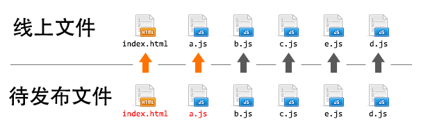

###减少外部HTTP请求
研究你网站的每个组成部分，消除任何影响访问者体验不好的成分。这些成分可能是：

* 不必要的图片
* 没用的 JavaScript 代码
* 过多的 css
* 多余的插件

### 压缩 CSS, JS 和 HTML
minify uglifyjs

###使用 CDN 和缓存提高速度
> 内容分发网络能显著提高网站的速度和性能。  
> 使用 CDN 时，您可以将网站的静态内容链接到全球各地的服务器扩展网络。如果您的网站观众遍布全球，这项功能十分有用。  
> CDN 允许您的网站访问者从最近的服务器加载数据。  

###压缩文件
> 对于那些不懂得前端优化的人来说，图片可能会是一个“网站杀手”。大量的写真集和庞大的高清图片会阻塞网页渲染速度。没有优化的高清图片可能会有几兆字节（mb）。因此适当地对它们进行优化可以改善网页的前端性能。
> 
> 每个图像文件都包含了一些与纯照片或图片无关的信息。比如 JPEG 图片，它包含了日期、地点、相机型号和一些其他不相关的信息。你可以用一些如 Optimus 的优化工具来删除这些多余的图像数据来精简图像的冗长的加载过程。因为 Optimus 是一个无损的图片压缩工具，它不会影响图像画质，只是压缩图片体积。

###性能优化原则及分类

po主先假设本文的读者是有前端开发经验的工程师，并对企业级web应用开发及性能优化有一定的思考，因此我不会重复介绍雅虎14条性能优化原则。如果您没有这些前续知识，请移步 这里 来学习。

首先，我们把雅虎14条优化原则，《高性能网站建设指南》以及《高性能网站建设进阶指南》中提到的优化点做一次梳理，按照优化方向分类，可以得到这样一张表格：

| 优化方向	| 优化手段 |
| :-------| :-----|
| 请求数量	| 合并脚本和样式表，CSS Sprites，拆分初始化负载，划分主域 |
| 请求带宽	| 开启GZip，精简JavaScript，移除重复脚本，图像优化 |
| 缓存利用	| 使用CDN，使用外部JavaScript和CSS，添加Expires头，减少DNS查找，配置ETag，使AjaX可缓存 |
| 页面结构	| 将样式表放在顶部，将脚本放在底部，尽早刷新文档的输出|
| 代码校验	| 避免CSS表达式，避免重定向 |

目前大多数前端团队可以利用 yui compressor 或者 google closure compiler 等压缩工具很容易做到 精简Javascript 这条原则；同样的，也可以使用图片压缩工具对图像进行压缩，实现 图像优化 原则。这两条原则是对单个资源的处理，因此不会引起任何工程方面的问题。很多团队也通过引入代码校验流程来确保实现 避免css表达式 和 避免重定向 原则。目前绝大多数互联网公司也已经开启了服务端的Gzip压缩，并使用CDN实现静态资源的缓存和快速访问；一些技术实力雄厚的前端团队甚至研发出了自动CSS Sprites工具，解决了CSS Sprites在工程维护方面的难题。使用“查找-替换”思路，我们似乎也可以很好的实现 划分主域 原则。

我们把以上这些已经成熟应用到实际生产中的优化手段去除掉，留下那些还没有很好实现的优化原则。再来回顾一下之前的性能优化分类：

|优化方向	|优化手段|
| :-------| :-----|
|请求数量	|合并脚本和样式表，拆分初始化负载|
|请求带宽	|移除重复脚本|
|缓存利用	|添加Expires头，配置ETag，使Ajax可缓存|
|页面结构	|将样式表放在顶部，将脚本放在底部，尽早刷新文档的输出|

有很多顶尖的前端团队可以将上述还剩下的优化原则也都一一解决，但业界大多数团队都还没能很好的解决这些问题。因此，本文将就这些原则的解决方案做进一步的分析与讲解，从而为那些还没有进入前端工业化开发的团队提供一些基础技术建设意见，也借此机会与业界顶尖的前端团队在工业化工程化方向上交流一下彼此的心得。

静态资源版本更新与缓存

缓存利用 分类中保留了 添加Expires头 和 配置ETag 两项。或许有些人会质疑，明明这两项只要配置了服务器的相关选项就可以实现，为什么说它们难以解决呢？确实，开启这两项很容易，但开启了缓存后，我们的项目就开始面临另一个挑战： 如何更新这些缓存？

相信大多数团队也找到了类似的答案，它和《高性能网站建设指南》关于“添加Expires头”所说的原则一样——修订文件名。即：

最有效的解决方案是修改其所有链接，这样，全新的请求将从原始服务器下载最新的内容。
思路没错，但要怎么改变链接呢？变成什么样的链接才能有效更新缓存，又能最大限度避免那些没有修改过的文件缓存不失效呢？

先来看看现在一般前端团队的做法：

	<h1>hello world</h1>

	
	
	
	
	
> ps: 也有团队采用构建版本号为静态资源请求添加query，它们在本质上是没有区别的，在此就不赘述了。

接下来，项目升级，比如页面上的html结构发生变化，对应还要修改 a.js 这个文件，得到的构建结果如下：

	<header>hello world</header>
	
	
	
	
	
	

为了触发用户浏览器的缓存更新，我们需要更改静态资源的url地址，如果采用构建信息（时间戳、版本号等）作为url修改的依据，如上述代码所示，我们只修改了一个a.js文件，但再次构建会让所有请求都更改了url地址，用户再度访问页面那些没有修改过的静态资源的(b.js，b.js，c.js，d.js，e.js)的浏览器缓存也一同失效了。

> 使用构建信息作为静态资源更新标记会导致每次构建发布后所有静态资源都被迫更新，浏览器缓存利用率降低，给性能带来伤害。

此外，采用添加query的方式来清除缓存还有一个弊端，就是 覆盖式发布 的上线问题。

采用query更新缓存的方式实际上要覆盖线上文件的，index.html和a.js总有一个先后的顺序，从而中间出现一段或大或小的时间间隔。尤其是当页面是后端渲染的模板的时候，静态资源和模板是部署在不同的机器集群上的，上线的过程中，静态资源和页面文件的部署时间间隔可能会非常长，对于一个大型互联网应用来说即使在一个很小的时间间隔内，都有可能出现新用户访问。在这个时间间隔中，访问了网站的用户会发生什么情况呢？

如果先覆盖index.html，后覆盖a.js，用户在这个时间间隙访问，会得到新的index.html配合旧的a.js的情况，从而出现错误的页面。   
如果先覆盖a.js，后覆盖index.html，用户在这个间隙访问，会得到旧的index.html配合新的a.js的情况，从而也出现了错误的页面。   
这就是为什么大型web应用在版本上线的过程中经常会较集中的出现前端报错日志的原因，也是一些互联网公司选择加班到半夜等待访问低峰期再上线的原因之一。

##Yahoo网站优化的14条规则

1. 减少HTTP请求.  
　　减少HTTP请求的方式很多，常见的包括CSS Sprites、合并JS和CSS、图片地图等。遵守这条规则可以改善首次访问网站的响应时间。	
　　80%的最终用户响应时间花在前端程序上，而其大部分时间则花在各种页面元素，如图像、样式表、脚本和Flash等，的下载上。减少页面元素将会减少HTTP请求次数。这是快速显示页面的关键所在。

2. 使用CDN（Content Delivery Network, 内容分发网络）	
　　只有10%-20%的最终用户响应时间花在了下载HTML文档上，其余的80%-90%时间花在了下载页面中的所有组件上。如果web服务器离服务器更近，则一个HTTP请求的响应时间将缩短。CDN是一组分布在多个不同地理位置的web服务器，每个服务器都拥有所有网站的文件副本，用户访问网站时，就可以从离用户最近的服务器发送所需的文件给客户端。
3. 添加Expires头	
　　通过使用Expires头，浏览器可以在用户首次访问网站后，将页面的资源缓存下来。可以为Expires指定过期时间，在指定时间后，缓存将失效。
　　expires是给一个资源设定一个过期时间，也就是说无需去服务端验证，直接通过浏览器自身确认是否过期即可，所以不会产生额外的流量。此种方法非常适合不经常变动的资源。如果文件变动较频繁，不要使用expires来缓存。
**expires起到控制页面缓存的作用，合理的配置expires可以减少很多服务器的请求。** **在服务器设置**

4. 启用Gzip	
　　客户端可以通过HTTP请求中的Accept-Encoding头来标识对压缩的支持（Accept-Encoding：gzip,deflate），服务器看到请求中有这个头，就会使用客户端列出的一种方法来压缩响应。大多数网站使用gzip压缩了HTML。**在服务器设置**

5. 将CSS放在顶部.  	
　　将CSS放在底部会发生无样式闪烁，浏览器会先加载HTML，然后加载CSS，会出现一段没有任何样式的“白屏时间”。而将CSS放在顶部则能规避这个问题。

6. 将脚本放在底部	
　　将脚本放在顶部或页面中，浏览器会对script标签内的内容进行解析，从而阻塞样式的渲染。除此之外，HTTP1.1规范建议浏览器从每个主机并行的下载两个组件，在高版本的IE和chrome、Firefox等浏览器则支持并行下载六个组件。但script会阻塞并行下载。因此我们应该将脚本放在底部。

7. 避免CSS表达式		
　　CSS表达式具备求值计算能力，然而每次页面发生重绘时，CSS表达式会影响页面的加载时间。

8. 使用外部JavaScript和CSS	
　　使用大量内联的JS和CSS就不能实现样式、结构、行为的分离，这样会在维护上造成很多麻烦，同时也会增大网页的体积。

9. 减少DNS查询	
　　通过使用Keep-Alive和较少的域名可以减少DNS查询

10. 精简JavaScript和CSS	
　　进行代码混淆可以压缩JS文件的大小，这个通过gulp等构建工具可以自动化的进行。

11. 避免重定向	
　　重定向用于将用户从一个URL重新路由到另一个URL。重定向有很多种，包括301永久重定向、302临时重定向，304 Not Modified并不是真正的重定向，它是用来响应Get请求，避免下载已经存在于浏览器缓存中的数据。在URL的结尾加上斜线（/）可以避免一部分重定向。

12. 移除重复脚本	
13. 配置ETag	
　　实体标签（Entity Tag）是web服务器和浏览器用于确认缓存资源的有效性的一种机制，它可以检测浏览器中缓存的资源与原始服务器上的资源是否匹配。ETag是唯一标识资源的一个特定版本的字符串，浏览器要验证一个资源，它会使用If-None-Match头将ETag传回原始服务器。如果ETag是匹配的，就会返回304状态码，从而使用浏览器缓存。

14. 缓存Ajax	
　　确保Ajax请求具有长久的Expires头

### MVVM 和 MVC

MVVM中的View 和 ViewModel可以互相通信。也就是可以互相调用。
MVC中的是单向通信。也就是View跟Model，必须通过Controller来承上启下