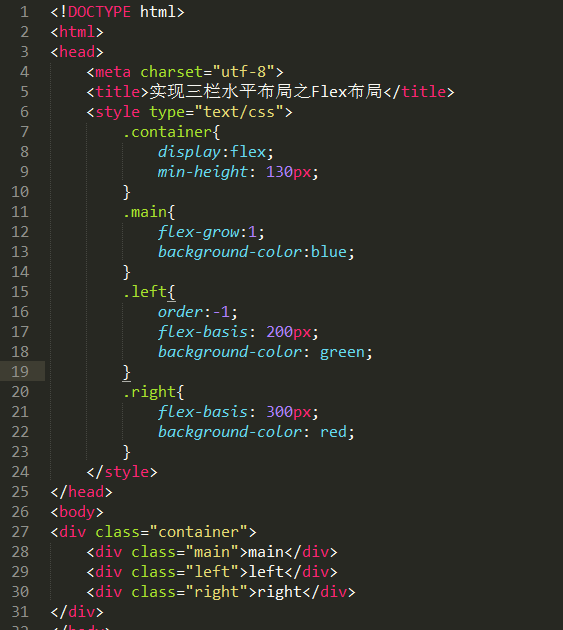

###css的优先级问题

1.  内联样式表的权值最高 1000；

2.  ID 选择器的权值为 100

3.  Class,伪类,熟悉 类选择器的权值为 10

4.  HTML 标签选择器的权值为 1

**当在一个样式声明上使用 !important 规则时，该样式声明会覆盖CSS中任何其他的声明,。尽管技术上 !important 与优先级毫无关系，**

一些经验法则：

Never 永远不要在全站范围的 css 上使用 !important  
Only 只在需要覆盖全站或外部 css（例如引用的 ExtJs 或者 YUI ）的特定页面中使用 !important   
Never 永远不要在你的插件中使用 !important  
Always 要优化考虑使用样式规则的优先级来解决问题而不是 !important  

###DPR

在早先的移动设备中，并没有DPR的概念。随着技术的发展，移动设备的屏幕像素密度越来越高。从iphone4开始，苹果公司推出了所谓的retina视网膜屏幕。之所以叫做视网膜屏幕，是因为屏幕的**PPI**(屏幕像素密度)太高，人的视网膜无法分辨出屏幕上的像素点。iphone4的分辨率提高了一倍，但屏幕尺寸却没有变化，这意味着同样大小的屏幕上，像素多了一倍，于是DPR = 2

而对于设备像素比DPR也有对应的javascript属性window.devicePixelRatio

**以iphone5为例，iphone5的CSS像素为320px \* 568px，DPR是2**，所以其设备像素为640px*1136px设备像素比DPR(devicePixelRatio)是默认缩放为100%的情况下，设备像素和CSS像素的比值

- DPI（Dots Per Inch,每英寸点数）
- PPI(Pixels Per Inch,屏幕像素密度)
- DPR(DevicePixelRatio,设备像素比)

##rem
rem（font size of the root element）是指相对于根元素的字体大小的单位（可以联想一下em）

rem的出现 使很多 移动端的自适应得到了改变，因为 rem是指相对于根元素的字体大小的单位，em是指相对于父元素的字体大小的单位 ，px是固定像素；

###推荐用法
根元素html

	html{	
		font-size:62.5%; /* 10÷16=62.5% */	
	}
	body{
		font-size:1.2rem ; /* 12÷10=1.2 */	
	}

## 垂直居中
### 文本
1、父元素高度确定的单行文本  
         
	 设置  height = line-height      
2 父元素高度确定的多行文本 
给父元素设置

	display:table-cell 
	vertical-align:middle
	
3 针对上面的情况，如果是父元素高度不确定的多行文本 

	给父元素的父元素增加css：display: table;

### 普通元素
### css2

	#wrapper {
	    display: table;
	}
	
	#cell {
	    display: table-cell;
	    vertical-align: middle;
	}
	
	
  
    	

        
Content goes here

    	

	
  

#### Absolute Positioning and Negative Margin

html
	
	

	    
Content here

	

css

	#parent {position: relative;}
	#child {
	    position: absolute;
	    top: 50%;
	    left: 50%;
	    height: 30%;
	    width: 50%;
	    margin: -15% 0 0 -25%;
	}

#### Absolute Positioning and Stretching

html
	
	

	    
Content here

	

css

	#parent {position: relative;}
	#child {
	    position: absolute;
	    top: 0;
	    bottom: 0;
	    left: 0;
	    right: 0;
	    width: 50%;
	    height: 30%;
	    margin: auto;
	}

#### css3
1.不知道自己高度和父容器高度的情况下, 利用绝对定位只需要以下三行：

	parentElement{
	        position:relative;
	    }
	
	 childElement{
	        position: absolute;
	        top: 50%;
	        transform: translateY(-50%);
	
	 }

2.若父容器下只有一个元素，且父元素设置了高度，则只需要使用相对定位即可

	parentElement{
	        height:xxx;
	    }
	
	    .childElement {
	      position: relative;
	      top: 50%;
	      transform: translateY(-50%);
	    }

### Flex 布局：
	parentElement{
	    display:flex;/*Flex布局*/
	    display: -webkit-flex; /* Safari */
	    align-items:center;/*指定垂直居中*/
	}

## 水平居中

1、行内元素

	父元素设置  text-align:center

2、定宽块状元素

	左右margin : auto

### Flex 布局：
	parentElement{
	    display:flex;/*Flex布局*/
	    display: -webkit-flex; /* Safari */
	    justify-content:center;
	}

## 双飞翼布局是如何在圣杯布局的基础上诞生

圣杯布局和双飞翼布局都是为了实现两边子面板宽度一定，中间主面板自适应。两者的差异并非题主所说的去掉相对定位就完全相同。

---
**圣杯布局的构造过程是：**

	
         
	    

        
	    

        
	    

  
	

	
1. 三者都设置向左浮动。
1. 设置main宽度为100%。
1. 设置 负边距，sub设置负左边距为100%，extra设置负左边距为负的自身宽度。
1. 设置bd的padding值给左右两个子面板留出空间。
1. 设置两个子面板为相对定位，sub的left值为负的sub宽度，extra的right值为负的extra宽度。

但是圣杯布局有个问题，**当面板的main部分比两边的子面板宽度小的时候，布局就会乱掉**。因此也就有了双飞翼布局来克服这个问题。如果不增加任何标签，想实现更完美的布局非常困难，因此双飞翼布局在主面板上选择了添加一个标签。

---
**双飞翼布局的构造过程是：**

	

	      
#main

	

	

        
	

	
1. 三者都设置向左浮动。
1. 设置main宽度为100%。
1. 设置 负边距，sub设置负左边距为100%，extra设置负左边距为负的自身宽度。
1. 设置main-content的margin值给左右两个子面板留出空间。

对比两者可以发现，双飞翼布局与圣杯布局的主要差别在于：

1. 双飞翼布局给主面板添加了一个父标签用来通过margin给子面板腾出空间。
1. 圣杯采用的是padding，而双飞翼采用的margin，解决了圣杯布局的问题。
1. 双飞翼布局不用设置相对布局，以及对应的left和right值。

相比之下，个人认为双飞翼布局更加简洁，响应式更好。

## flex实现

## css3 三角形
保留底边框的颜色，其他边框的颜色设置为透明

    .triangle6{
	    width:0px;
	    height:0px;
	    border-left:100px solid transparent;
	    border-bottom: 100px solid red;
	    border-top:100px solid transparent;
	    border-right: 100px solid transparent;
    }

## css3动画 

animation ：动画

> 如需在 CSS3 中创建动画，您需要学习 @keyframes 规则。
> @keyframes 规则用于创建动画

transition：过渡

> CSS3 过渡是元素从一种样式逐渐改变为另一种的效果。
> 
> 要实现这一点，必须规定两项内容：

* 规定您希望把效果添加到哪个 CSS 属性上
* 规定效果的时长
应用于宽度属性的过渡效果，时长为 2 秒：

		div	{
			transition: width 2s;
			-moz-transition: width 2s;	/* Firefox 4 */
			-webkit-transition: width 2s;	/* Safari 和 Chrome */
			-o-transition: width 2s;	/* Opera */
			}

transform：转换

* translate() 元素从其当前位置移动，根据给定的 left（x 坐标） 和 top（y 坐标） 位置参数：
* rotate() 元素顺时针旋转给定的角度。允许负值，元素将逆时针旋转。
* scale() 元素的尺寸会增加或减少，根据给定的宽度（X 轴）和高度（Y 轴）参数：
* skew() 元素翻转给定的角度，根据给定的水平线（X 轴）和垂直线（Y 轴）参数
* matrix() matrix() 方法把所有 2D 转换方法组合在一起

		div	{
		transform: rotate(30deg);
		-ms-transform: rotate(30deg);		/* IE 9 */
		-webkit-transform: rotate(30deg);	/* Safari and Chrome */
		-o-transform: rotate(30deg);		/* Opera */
		-moz-transform: rotate(30deg);		/* Firefox */
		}

> 转换是使元素改变形状、尺寸和位置的一种效果。
> 您可以使用 2D 或 3D 转换来转换您的元素。

text-shadow: 字体阴影

您能够规定水平阴影、垂直阴影、模糊距离，以及阴影的颜色：
	
	h1
	{
	text-shadow: 5px 5px 5px #FF0000;
	}

## less

Node.js 环境中使用 Less ：

npm install -g less
> lessc styles.less styles.css 

在浏览器环境中使用 Less ：

	<link rel="stylesheet/less" type="text/css" href="styles.less" />
	
	
[https://less.bootcss.com](https://less.bootcss.com)

* 变量（Variables）
* 混入（Mixins）
* 嵌套（Nesting）
* 运算（Operations）
* 作用域（Scope）
* 注释（Comments）
* 导入（Importing）
