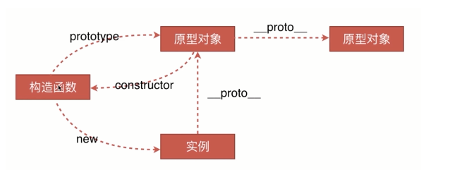
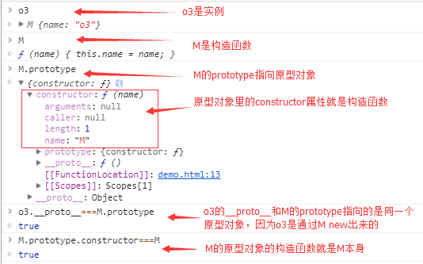

## 正则表达式

	var patt1 = new RegExp("e"); //RegExp 对象
	var patt = /e/; //简写


### 1. RegExp 对象
**test()**

用于检测一个字符串是否匹配某个模式，如果字符串中含有匹配的文本，则返回 true，否则返回 false。

	var patt = /e/;
	patt.test("The best things in life are free!");

**exec()**


exec() 方法用于检索字符串中的正则表达式的匹配。

```
var str="Hello world!";
//查找"Hello"
var patt=/Hello/g;
var result=patt.exec(str);

```

该函数返回一个数组，其中存放匹配的结果。如果未找到匹配，则返回值为 null。

**compile()**

编译正则表达式。

### 2. 字符串方法


**search()**  

用于检索字符串中指定的子字符串，或检索与正则表达式相匹配的子字符串，并返回子串的起始位置。

	var str = "Visit Runoob!"; 
	var n = str.search("Runoob");

**replace()** 

用于在字符串中用一些字符替换另一些字符，或替换一个与正则表达式匹配的子串。

	var str = document.getElementById("demo").innerHTML; 
	var txt = str.replace(/microsoft/i,"Runoob");

**match()**

找到一个或多个正则表达式的匹配。

**split()**

把字符串分割为字符串数组。

### 常用正则表达式
	匹配手机号
	/^1[34578]\d{9}$/

	电话号码
	/^0\d{2,3}-?\d{7,8}$/

	匹配邮箱
	/^(\w-*\.*)+@(\w-?)+(\.\w{2,})+$/

	匹配用户名
	/^[a-zA-z]\w{3,15}$/
	
	\w：匹配包括下划线的任何单词字符。等价于'[A-Za-z0-9_]'。


#### 字符串常用的函数

其实在控制台打印一下就有了的

- charAt() 返回在指定位置的字符。
- concat() 连接字符串。
- fromCharCode() 从字符编码创建一个字符串。
- indexOf() 检索字符串。
- match() 找到一个或多个正则表达式的匹配。
- replace() 替换与正则表达式匹配的子串。
- search() 检索与正则表达式相匹配的值。
- slice() 提取字符串的片断，并在新的字符串中返回被提取的部分。
- split() 把字符串分割为字符串数组。
- substr() 从起始索引号提取字符串中指定数目的字符。
- substring() 提取字符串中两个指定的索引号之间的字符。
- toLocaleLowerCase() 把字符串转换为小写。
- toLocaleUpperCase() 把字符串转换为大写。
- toLowerCase() 把字符串转换为小写。
- toUpperCase() 把字符串转换为大写。
- toString() 返回字符串。
- valueOf() 返回某个字符串对象的原始值。

#### 数组常用的函数


- concat() 连接两个或更多的数组，并返回结果。
- join() 把数组的所有元素放入一个字符串。元素通过指定的分隔符进行分隔。
- pop() 删除并返回数组的最后一个元素 ##
- push() 向数组的末尾添加一个或更多元素，并返回新的长度。##
- reverse() 颠倒数组中元素的顺序。 ##
- shift() 删除并返回数组的第一个元素 ##
- slice() 从某个已有的数组返回选定的元素
- sort() 对数组的元素进行排序 ##
- splice() 删除元素，并向数组添加新元素。 ##
- split() 分割数组
- toString() 把数组转换为字符串，并返回结果。
- unshift() 向数组的开头添加一个或更多元素，并返回新的长度。 ##
- valueOf() 返回数组对象的原始值。

  > map,filter,forEach,some,every等不改变原数组??


链接：https://www.imooc.com/article/23750

## map foreach filter reduce之间的区别

### 结果（返回值）不一样

forEach()结果是undefined；map和filter结果是Array，但是filter不会改变原始数组，只会返回一个新数组；reduce结果是单个值。

### 返回值不同

前面讲的结果（返回值）是指方法的返回值，这里要讲的是回调函数的返回值。

forEach的回调函数不需要返回值，在jQuery的each方法中使用return false来打断循环，但在forEach里面，return无效，无论如何，都会完全遍历整个数组的所有元素。

reduce的回调函数返回值是一个单纯的值，如果是求数值的和的话，就是一个数字。

map的回调函数返回值也是一个值，但这个值将直接替换当前遍历到的这个元素，从而引发原始数组的改变。如果元素是一个对象的话，应该尽可能做到对象结构的不变，只是属性或方法内容的改变。

filter的回调函数的返回值是一个boolean值，为true时保留这个元素，为false时filter的返回值中不包括这个元素。（filter不会对数组自己进行修改，而是返回一个新数组。）


#### map会改变原始数组吗

正常情况不会, 除非**在循环里面直接把原数组改了**

> 对象是引用类型, 传递的是地址,  item.key = index 会修改原数组中的 对象

https://segmentfault.com/q/1010000018683143


### 使用场景不同

forEach用于看，map用于改，filter用于删，reduce用于统计。

forEach除了上面讲到的return无效，continue/break等也无效。


从参数的角度讲，map、filter和forEach是一样的

https://www.tangshuang.net/2875.html


## 数组去重

#### 1. es6的set

    var arr = [1,2,3,3,4,5,5];
    var set = new Set(arr);
    var newArr = Array.from(set);
 or   
 
    [...new Set(arr)]

> ES6提供了数据结构Set。类似于数组，但是没有重复值。

> 可用于数组去重`[...new Set(array)]`
>
> Array.from()方法可以将Set结构转换为数组`Array.from(new Set(array))`

#### 2.
 定义一个变量数组 res 保存结果，遍历需要去重的数组，如果该元素已经存在在 res 中了，则说明是重复的元素，如果没有，则放入 res 中

    function unique(a) {
      var res = [];
    
      for (var i = 0, len = a.length; i < len; i++) {
        var item = a[i];
    
     for (var j = 0, jLen = res.length; j < jLen; j++) {
          if (res[j] === item)
            break;
        }
    
        if (j === jLen)
          res.push(item);
      }
    
      return res;
    }
    
#### 3. ES5 提供的 Array.prototype.indexOf 

    function unique(a) {  
      var res = [];  
      
      for (var i = 0, len = a.length; i < len; i++) {  
        var item = a[i];  
      
        (res.indexOf(item) === -1) && res.push(item);  
      }  
      
      return res;  
    }  
#### 4. ES5 的filter

    function unique(arr) {        
      var res = arr.filter(function(item, index, array) {  
        return array.indexOf(item) === index;  
      });          
      return res;  
    }  


### 构造函数,实例与原型对象的关系



	var M = function (name) { 
      this.name = name; 
    }   //M是构造函数

	var o3 = new M('o3') //o3是实例



#### 原型对象都有一个默认的constructor属性指向构造函数

## new运算符

- 1.创了一个新对象;
- 2.this指向构造函数;
- 3.构造函数有返回,会替换new出来的对象, 如果没有就是new出来的对象

#### 手动封装一个new运算符


	var new2 = function (func) {
	    var o = Object.create(func.prototype); 　　 //创建对象
	    var k = func.call(o);　　　　　　　　　　　　　//改变this指向，把结果付给k
	    if (typeof k === 'object') {　　　　　　　　　//判断k的类型是不是对象
	        return k;　　　　　　　　　　　　　　　　　 //是，返回k
	    } else {
	        return o;　　　　　　　　　　　　　　　　　 //不是返回返回构造函数的执行结果
	    }
	}  

#### Object.create()
Object.create(o)的作用是创建一个空对象，空对象的原型是参数o：

#### new
new配合构造函数使用，创建一个新对象。

## JavaScript中的可枚举属性与不可枚举属性

在JavaScript中，对象的属性分为可枚举和不可枚举之分，它们是由属性的enumerable值决定的。可枚举性决定了这个属性能否被for…in查找遍历到。

Object对象的propertyIsEnumerable()方法可以判断此对象是否包含某个属性，并且这个属性是否可枚举。

> 需要注意的是：如果判断的属性存在于Object对象的原型内，不管它是否可枚举都会返回false。

  js中基本包装类型的原型属性是不可枚举的,但普通对象的原型里的`__proto__`属性会被for in 遍历到

## JS的观察者模式（自定义事件）


## JavaScript模拟事件和自定义事件

#### 模拟事件

模拟事件的创建方式有两种：

1. 老版：通过document.createEvent()方法创建各事件类型对象。

1. 新版：通过各事件的构造函数创建事件类型对象。

注：老版本方式将会被新版本方式所替代。


