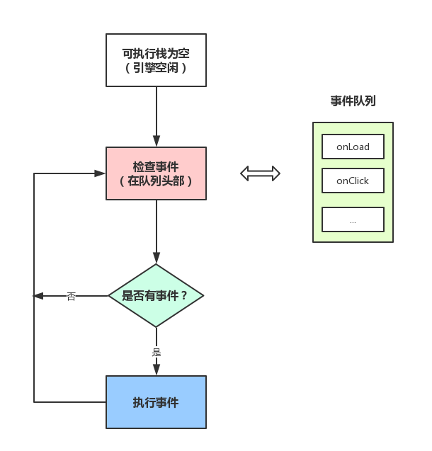

## 事件循环（Event Loop）和任务队列

### 和JS运行有关的几个线程

* JS引擎线程
* 事件触发线程
* 定时触发器线程

#### JS引擎是单线程

* JS分为同步任务和异步任务
* 同步任务都在主线程上执行，形成一个**执行栈**
* 主线程之外，**事件触发线程**管理着一个任务队列，只要有异步任务，就在任务队列之中放置一个事件。
* 一旦执行栈中的所有同步任务执行完毕（此时JS引擎空闲），主线程就会读取任务队列，将可运行的异步任务添加到可执行栈中，开始执行。

> 到这里，应该就可以理解了：为什么有时候setTimeout推入的事件不能准时执行？因为可能在它推入到事件列表时，主线程还不空闲，正在执行其它代码，
> 所以自然有误差。

### 事件循环机制

[Help, I'm stuck in an event-loop](http://vimeo.com/96425312)

上图大致描述就是：

主线程运行时会产生执行栈，
栈中的代码调用某些api时，它们会在事件队列中添加各种事件（当满足触发条件后，如ajax请求完毕）

* 而栈中的代码执行完毕，就会读取事件队列中的事件，去执行那些回调
* 如此循环
* 注意，总是要等待栈中的代码执行完毕后才会去读取事件队列中的事件

### 定时器线程

**上述事件循环机制的核心是：JS引擎线程和事件触发线程**

但事实上，里面还有一些隐藏细节，譬如调用setTimeout后，是如何等待特定时间后才添加到事件队列中的？

#### 是JS引擎检测的么？
不是。**它是由定时器线程控制**

#### 为什么要单独的定时器线程？
因为JavaScript引擎是单线程的, 如果处于阻塞线程状态就会影响记计时的准确，因此很有必要单独开一个线程用来计时。

#### 什么时候会用到定时器线程？
当使用setTimeout或setInterval时，它需要定时器线程计时，计时完成后就会将特定的事件推入事件队列中。

譬如:

	setTimeout(function(){
	    console.log('hello!');
	}, 1000);
这段代码的作用是当1000毫秒计时完毕后（由定时器线程计时），将回调函数推入事件队列中，等待主线程执行

	setTimeout(function(){
	    console.log('hello!');
	}, 0);
	
	console.log('begin');
这段代码的效果是最快的时间内将回调函数推入事件队列中，等待主线程执行

**注意：**

执行结果是：先begin后hello!

> 虽然代码的本意是0毫秒后就推入事件队列，但是W3C在HTML标准中规定，规定要求setTimeout中低于4ms的时间间隔算为4ms。
> (不过也有一说是不同浏览器有不同的最小时间设定)
> 
> 就算不等待4ms，就算假设0毫秒就推入事件队列，也会先执行begin（因为只有可执行栈内空了后才会主动读取事件队列）

### setTimeout和setInterval

用setTimeout模拟定期计时和直接用setInterval是有区别的。

**setTimeout**每次计时到后就会去执行，然后执行一段时间后才会继续setTimeout，中间就多了误差（误差多少与代码执行时间有关）

**setInterval**则是每次都精确的隔一段时间推入一个事件
（但是，事件的实际执行时间不一定就准确，还有可能是这个事件还没执行完毕，下一个事件就来了）

#### setInterval有一些比较致命的问题就是：

**累计效应**，如果setInterval代码在（setInterval）再次添加到队列之前还没有完成执行，
就会导致定时器代码连续运行好几次，而之间没有间隔。

就算正常间隔执行，多个setInterval的代码执行时间可能会比预期小（因为代码执行需要一定时间）

> 而且把浏览器最小化显示等操作时，setInterval并不是不执行程序，
> 它会把setInterval的回调函数放在队列中，等浏览器窗口再次打开时，一瞬间全部执行时

目前一般认为的最佳方案是：用setTimeout模拟setInterval，或者特殊场合直接用requestAnimationFrame