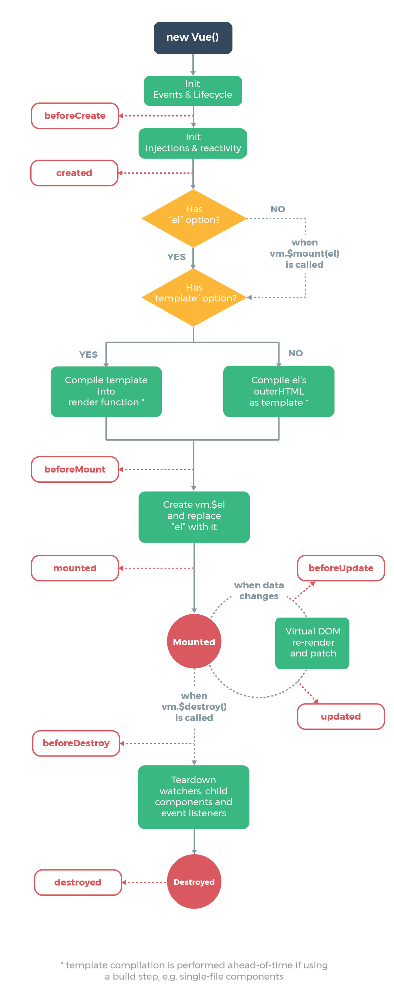

### vue案例

- https://github.com/coligo-io/notes-app-vuejs-vuex
- https://github.com/liangxiaojuan/vue-Meizi
- https://github.com/superman66/vue-axios-github
- https://github.com/skyronic/vue-spa
- https://github.com/allan2coder/VUE2-SPA-Tutorial
- https://github.com/alloyteamzy/vue2_blog
- https://github.com/bailicangdu/vue2-happyfri
- https://github.com/keepfool/vue-tutorials
- https://github.com/Awheat/vue2-douban-market
- https://github.com/wszgxa/vue-cnode

## vuex

mapetter
mapstate
mapaction

## vue学习过程

#### 声明式渲染

Vue.js 的核心是一个允许采用简洁的模板语法来声明式地将数据渲染进 DOM 的系统：

	

	  {{ message }}
	

	var app = new Vue({
	  el: '#app',
	  data: {
	    message: 'Hello Vue!'
	  }
	})

#### 在 Vue 中注册组件

	// 定义名为 todo-item 的新组件
	Vue.component('todo-item', {
	  template: '<li>这是个待办项</li>'
	})

现在你可以用它构建另一个组件模板：

	<ol>
	  <!-- 创建一个 todo-item 组件的实例 -->
	  <todo-item></todo-item>
	</ol>

但是这样会为每个待办项渲染同样的文本，这看起来并不炫酷。我们应该能从父作用域将数据传到子组件才对。让我们来修改一下组件的定义，使之能够接受一个 prop：
	
	Vue.component('todo-item', {
	  // todo-item 组件现在接受一个
	  // "prop"，类似于一个自定义特性。
	  // 这个 prop 名为 todo。
	  props: ['todo'],
	  template: '<li>{{ todo.text }}</li>'
	})

#### 创建一个 Vue 实例

	var vm = new Vue({
	  // 选项
	})

除了数据属性，Vue 实例还暴露了一些有用的实例属性与方法。它们都有前缀 \$，以便与用户定义的属性区分开来。例如：
	
	var data = { a: 1 }
	var vm = new Vue({
	  el: '#example',
	  data: data
	})
	
	vm.$data === data // => true
	vm.$el === document.getElementById('example') // => true
	
	// $watch 是一个实例方法
	vm.$watch('a', function (newValue, oldValue) {
	  // 这个回调将在 `vm.a` 改变后调用
	})

#### 模板语法
##### 文本(Text)
数据绑定最基本的形式，就是使用 “mustache” 语法（双花括号）的文本插值(text interpolation)：

	Message: {{ msg }}

#### 原始 HTML(Raw HTML)

	
使用双花括号语法：{{ rawHtml }}

	
使用 v-html 指令：

#### 属性(Attributes)

不能在 Vue 模板中的 HTML 属性上使用双花括号语法(mustache)。而是应该使用 v-bind 指令：

	

在属性是布尔类型的一些情况中，v-bind 的作用有点不同，只要值存在就会隐含为 true。在这个例子中：

	<button v-bind:disabled="isButtonDisabled">Button</button>

#### 使用 JavaScript 表达式
到目前为止，我们只实现了将模板绑定到基本的属性键上。然而，Vue.js 实际上能够支持通过完整的 JavaScript 表达式，将模板与任意的数据绑定在一起：

	{{ number + 1 }}
	
	{{ ok ? 'YES' : 'NO' }}
	
	{{ message.split('').reverse().join('') }}
	
	

#### 指令(Directives)

指令(directive)是带有 v- 前缀的特殊属性

	
Now you see me

#### 参数(Arguments)

一些指令能够接收一个“参数”，在指令名称之后以 : 表示。例如，v-bind 指令可以用于响应式地更新 HTML 属性：

	<a v-bind:href="url"> ... </a>
这里 href 是参数，告知 v-bind 指令将元素的 href 属性与表达式 url 的值绑定在一起。

另一个示例是 v-on 指令，用于监听 DOM 事件：

	<a v-on:click="doSomething"> ... </a>
这里，参数是要监听事件的名称

#### 修饰符(Modifiers)

修饰符(modifier)是以 . 表示的特殊后缀，表明应当以某种特殊方式绑定指令。例如，.prevent 修饰符告诉 v-on 指令，在触发事件后调用 event.preventDefault()：

	<form v-on:submit.prevent="onSubmit"> ... </form>

#### v-bind 简写
	<!-- 完整语法 -->
	<a v-bind:href="url"> ... </a>
	
	<!-- 简写 -->
	<a :href="url"> ... </a>
#### v-on 简写
	<!-- 完整语法 -->
	<a v-on:click="doSomething"> ... </a>
	
	<!-- 简写 -->
	<a @click="doSomething"> ... </a>

#### 计算属性

在模板中放入太多的逻辑会让模板过重且难以维护。例如：

	

	  {{ message.split('').reverse().join('') }}
	

对于任何复杂逻辑，应当使用计算属性。
	
	

	  
Original message: "{{ message }}"

	  
Computed reversed message: "{{ reversedMessage }}"

	

	var vm = new Vue({
	  el: '#example',
	  data: {
	    message: 'Hello'
	  },
	  computed: {
	    // 计算属性的 getter
	    reversedMessage: function () {
	      // `this` 指向 vm 实例
	      return this.message.split('').reverse().join('')
	    }
	  }
	})

计算属性缓存 vs 方法

相比之下，每当触发重新渲染时，**调用方法将总会再次执行函数**

**计算属性 vs 侦听属性**

	
{{ fullName }}

	var vm = new Vue({
	  el: '#demo',
	  data: {
	    firstName: 'Foo',
	    lastName: 'Bar',
	    fullName: 'Foo Bar'
	  },
	  watch: {
	    firstName: function (val) {
	      this.fullName = val + ' ' + this.lastName
	    },
	    lastName: function (val) {
	      this.fullName = this.firstName + ' ' + val
	    }
	  }
	})
上面代码是命令式且重复的。将它与计算属性的版本进行比较：

	var vm = new Vue({
	  el: '#demo',
	  data: {
	    firstName: 'Foo',
	    lastName: 'Bar'
	  },
	  computed: {
	    fullName: function () {
	      return this.firstName + ' ' + this.lastName
	    }
	  }
	})

好得多了，不是吗？

#### class 和 style 绑定

	

	

然后，给定以下 data：
	
	data: {
	  isActive: true,
	  hasError: false
	}
将会渲染为：

	

绑定对象，也可以无需内联，而是外部引用 data：
	
	

	data: {
	  classObject: {
	    active: true,
	    'text-danger': false
	  }
	}

我们还可以将 class 和 style 与某个 computed 属性绑定在一起，此 computed 属性所对应的 getter 函数需要返回一个对象。这是一种常用且强大的用法：

	

	data: {
	  isActive: true,
	  error: null
	},
	computed: {
	  classObject: function () {
	    return {
	      active: this.isActive && !this.error,
	      'text-danger': this.error && this.error.type === 'fatal'
	    }
	  }
	}

#### 数组语法
我们可以向 v-bind:class 传入一个数组，来与 class 列表对应：

	

	data: {
	  activeClass: 'active',
	  errorClass: 'text-danger'
	}
会被渲染为：

	

#### 数组语法 style
v-bind:style 的数组语法，可以在同一个元素上，使用多个 style 对象：

	

#### 用 key 控制元素是否可复用

### v-if 和 v-show

v-if 是“真实”的条件渲染，因为它会确保条件块(conditional block)在切换的过程中，完整地销毁(destroy)和重新创建(re-create)条件块内的事件监听器和子组件。

v-if 是惰性的(lazy)：如果在初始渲染时条件为 false，它不会执行任何操作 - 在条件第一次变为 true 时，才开始渲染条件块。

相比之下，v-show 要简单得多 - 不管初始条件如何，元素始终渲染，并且只是基于 CSS 的切换。

通常来说，v-if 在切换时有更高的性能开销，而 v-show 在初始渲染时有更高的性能开销。因此，如果需要频繁切换，推荐使用 v-show，如果条件在运行时改变的可能性较少，推荐使用 v-if。

当与 v-if 一起使用时，**v-for 具有比 v-if 更高的优先级**。

#### 带有 v-if 的 v-for
当它们都处于同一节点时，v-for 的优先级高于 v-if。这意味着，v-if 将分别在循环中的每次迭代上运行。当你只想将某些项渲染为节点时，这会非常有用，如下：

	<li v-for="todo in todos" v-if="!todo.isComplete">
	  {{ todo }}
	</li>
以上只渲染 todos 中未完成的项。

如果你的意图与此相反，是根据条件跳过执行循环，可以将 \v-if 放置于包裹元素上（或放置于 \<template\ß> 上）。例如：

	<ul v-if="todos.length">
	  <li v-for="todo in todos">
	    {{ todo }}
	  </li>
	</ul>
	
No todos left!

译注：

**变化数组方法**：会对原数组操作的数组方法，如 pop(), shift(), unshift(), splice(), sort() 和 reverse()。

**非变化数组方法**：不会对原数组操作、返回新数组的数组方法，如 filter(), concat() 和 slice()。

### 事件处理

#### 监听事件

我们可以使用 v-on 指令监听 DOM 事件，并在事件被触发时执行一些 JavaScript 代码。

	

	  <button v-on:click="counter += 1">增加 1</button>
	  
上面的按钮被点击了 {{ counter }} 次。

	

	var example1 = new Vue({
	  el: '#example-1',
	  data: {
	    counter: 0
	  }
	})

#### 定义在 methods 对象中的事件处理器

由于许多事件处理器的逻辑很复杂，所以把 JavaScript 代码都保存在 v-on 属性的值中是不可行的做法。这就是为什么 v-on 还可以接收要调用的方法名。

	

	  <!-- `greet` 是在下面 methods 中定义的方法名 -->
	  <button v-on:click="greet">Greet</button>
	

	var example2 = new Vue({
	  el: '#example-2',
	  data: {
	    name: 'Vue.js'
	  },
	  // 在 `methods` 对象中定义方法
	  methods: {
	    greet: function (event) {
	      // methods 里的方法中的 `this` 指 Vue 实例
	      alert('Hello ' + this.name + '!')
	      // `event` 是原始 DOM 事件对象
	      if (event) {
	        alert(event.target.tagName)
	      }
	    }
	  }
	})
	
	// 也可以在 JavaScript 中通过 Vue 实例直接调用方法
	example2.greet() // => 'Hello Vue.js!'

#### 定义在行内的事件处理器

除了直接绑定到方法名，我们还可以在行内 JavaScript 语句中使用 methods 方法：

	

	  <button v-on:click="say('hi')">Say hi</button>
	  <button v-on:click="say('what')">Say what</button>
	

	new Vue({
	  el: '#example-3',
	  methods: {
	    say: function (message) {
	      alert(message)
	    }
	  }
	})

在行内语句的事件处理器中，有时我们也需要访问原始 DOM 事件对象。可以使用特殊的 \$event 变量将它传递给一个方法：

	<button v-on:click="warn('Form cannot be submitted yet.', \$event)">
	  Submit
	</button>
	// ...
	methods: {
	  warn: function (message, event) {
	    // 现在，我们可以访问原始事件对象
	    if (event) event.preventDefault()
	    alert(message)
	  }
	}
#### 事件修饰符(Event Modifiers)

	<!-- 停止点击事件冒泡 -->
	
	
	<!-- 提交事件不再重新载入页面 -->
	<form v-on:submit.prevent="onSubmit"></form>
	
	<!-- 修饰符可以链式调用 -->
	
	
	<!-- 只有修饰符 -->
	<form v-on:submit.prevent></form>
	
	<!-- 添加事件监听器时，使用事件捕获模式 -->
	<!-- 也就是说，内部元素触发的事件先在此处处理，然后才交给内部元素进行处理 -->
	
...

	
	<!-- 只有在 event.target 是元素自身时，才触发处理函数。 -->
	<!-- 也就是说，event.target 是子元素时，不触发处理函数 -->
	
...

使用 v-on:click.prevent.self 会阻止所有点击

而 v-on:click.self.prevent 只阻止元素自身的点击。

#### 按键修饰符(Key Modifiers)

	<!-- 只在 `keyCode` 是 13 时，调用 `vm.submit()` -->
	<input v-on:keyup.13="submit">

记住所有 keyCode 是非常麻烦的事，所以 Vue 提供一些最常用按键的别名：
	
	<!-- 和上面的示例相同 -->
	<input v-on:keyup.enter="submit">
	
	<!-- 也可用于简写语法 -->
	<input @keyup.enter="submit">

#### checkbox

单选 checkbox，绑定到布尔值：

	<input type="checkbox" id="checkbox" v-model="checked">
	<label for="checkbox">{{ checked }}</label>

多选 checkbox，绑定到同一个数组：

	

	  <input type="checkbox" id="jack" value="Jack" v-model="checkedNames">
	  <label for="jack">Jack</label>
	  <input type="checkbox" id="john" value="John" v-model="checkedNames">
	  <label for="john">John</label>
	  <input type="checkbox" id="mike" value="Mike" v-model="checkedNames">
	  <label for="mike">Mike</label>
	   
	  勾选的名字是：{{ checkedNames }}
	

	new Vue({
	  el: '#example-3',
	  data: {
	    checkedNames: []
	  }
	})

radio

	<input type="radio" id="one" value="One" v-model="picked">
	<label for="one">One</label>
	 
	<input type="radio" id="two" value="Two" v-model="picked">
	<label for="two">Two</label>
	 
	选中的是：{{ picked }}

### select
	
	<select v-model="selected">
	  <option disabled value="">请选择其中一项</option>
	  <option>A</option>
	  <option>B</option>
	  <option>C</option>
	</select>
	选中的是：{{ selected }}
	new Vue({
	  el: '...',
	  data: {
	    selected: ''
	  }
	})

#### 多选 select（绑定到一个数组）：

	<select v-model="selected" multiple>
	  <option>A</option>
	  <option>B</option>
	  <option>C</option>
	</select>
	 
	选中的是：{{ selected }}

使用 v-for 渲染动态的 option：

	<select v-model="selected">
	  <option v-for="option in options" v-bind:value="option.value">
	    {{ option.text }}
	  </option>
	</select>
	选中的是：{{ selected }}
	new Vue({
	  el: '...',
	  data: {
	    selected: 'A',
	    options: [
	      { text: 'One', value: 'A' },
	      { text: 'Two', value: 'B' },
	      { text: 'Three', value: 'C' }
	    ]
	  }
	})
#### 与 value 属性绑定

对于 radio, checkbox 和 select 的 option 选项，通常可以将 v-model 与值是静态字符串的 value 属性关联在一起（或者，在 checkbox 中，绑定到布尔值）：
	
	<!-- 当选中时，`picked` 的值是字符串 "a"（译者注：如果没有 value 属性，选中时值是 null） -->
	<input type="radio" v-model="picked" value="a">
	
	<!-- `toggle` 的值是 true 或 false -->
	<input type="checkbox" v-model="toggle">
	
	<!-- 当选中第一个选项时，`selected` 的值是字符串 "abc"（译者注：如果没有 value 属性，选中时 selected 值是 option 元素内的文本） -->
	<select v-model="selected">
	  <option value="abc">ABC</option>
	</select>

然而，有时可能需要把 value 与 Vue 实例上的一个动态属性绑定在一起。这时我们可以通过 v-bind 来实现。v-bind 还允许我们将 input 元素的值绑定到非字符串值。

#### checkbox
	
	<input
	  type="checkbox"
	  v-model="toggle"
	  true-value="yes"
	  false-value="no"
	>

> true-value 和 false-value 属性不会影响到 input 元素的 value 属性，这是因为浏览器在提交表单时，并不会包含未被选中的 checkbox 的值。如果要确保表单中，这两个值的一个能够被提交（例如 “yes” 或 “no”），请换用类型是 radio 的 input 元素。

#### select 选项
	<select v-model="selected">
	  <!-- 内联对象字面量 -->
	  <option v-bind:value="{ number: 123 }">123</option>
	</select>

	// 选中时：
	typeof vm.selected // => 'object'
	vm.selected.number // => 123

### 修饰符(modifiers)

- .lazy
- .number
- .trim

## 组件基础

这里是一个 Vue 组件示例：

	// 定义一个新的组件，名称为 button-counter
	Vue.component('button-counter', {
	  data: function () {
	    return {
	      count: 0
	    }
	  },
	  template: '<button v-on:click="count++">你点击了 {{ count }} 次。</button>'
	})

组件(component)，是具有 name 名称的可复用 Vue 实例：当前示例中是 <button-counter>。

我们可以使用 new Vue 创建出一个 Vue 根实例，然后将这个组件作为其中的一个自定义元素(custom element)：

	

	  <button-counter></button-counter>
	

	new Vue({ el: '#components-demo' })

由于组件是可复用的 Vue 实例，它们接收的选项，和在 new Vue 时候的选项相同，例如 data, computed, watch, methods 和生命周期钩子。

唯一的例外是，类似 el 这样，根实例上特有(root-specific)的选项。

可以根据需要，多次重复使用组件：

注意，当点击按钮时，每个按钮都维护彼此独立的 count。这是因为每次使用组件时，都会创建出一个新的组件实例。

**data 必须是一个函数**

组件的 data 选项必须是一个函数，以便每个实例都可以维护「函数返回的数据对象」的彼此独立的数据副本

组件注册有两种方式：**全局注册**和**局部注册**

### 在组件中使用less

	
### 使用 props 向子组件传递数据

props 是指注册在组件选项上的自定义属性。当一个值，被放置在 props 中，作为其中一个 prop，这个值就会成为组件实例上，一个可访问的属性。

	Vue.component('blog-post', {
	  props: ['title'],
	  template: '<h3>{{ title }}</h3>'
	})
在预先注册好一个 prop 属性之后，就可以将数据作为自定义属性传递给这个 prop 属性，如下所示：

	<blog-post title="我的 Vue 旅程"></blog-post>
	<blog-post title="用 Vue 写博客"></blog-post>
	<blog-post title="Vue 如此有趣"></blog-post>
	
然而，在一个应用程序中，你常常会将 data 中的 posts 设为一个数组：

	new Vue({
	  el: '#blog-post-demo',
	  data: {
	    posts: [
	      { id: 1, title: '我的 Vue 旅程' },
	      { id: 2, title: '用 Vue 写博客' },
	      { id: 3, title: 'Vue 如此有趣' },
	    ]
	  }
	})

然后，将每条数据渲染为一个组件：

	<blog-post
	  v-for="post in posts"
	  v-bind:key="post.id"
	  v-bind:title="post.title">
	  </blog-post>
### 单个根元素

 every component must have a single root element
 
	 

	  <h3>{{ post.title }}</h3>
	  

	

### 使用 events 向父组件发送消息
	

	  

	    <blog-post
	      v-for="post in posts"
	      v-bind:key="post.id"
	      v-bind:post="post"
	    ></blog-post>
	  

	

---
	<button v-on:click="$emit('enlarge-text')">
	  放大文本
	</button>
	
	<blog-post
	  ...
	  v-on:enlarge-text="postFontSize += 0.1">
		</blog-post>

		
### 在 event 事件中发送一个值
有时，想在 event 事件中发送一个特定的值。例如，我们可能想要在 \<blog-post\> 组件自身内部，去控制放大文本字号的间隔。在这种情况下，我们可以使用 \$emit 的第二个参数来提供字号间隔值：

	<button v-on:click="$emit('enlarge-text', 0.1)">
	  放大文本
	</button>
	
	<blog-post
	  ...
	  v-on:enlarge-text="postFontSize += $event"
	></blog-post>

或者，如果事件处理函数是一个方法：

	<blog-post
	  ...
	  v-on:enlarge-text="onEnlargeText"
	></blog-post>
然后，这个值会被传入到方法中，作为第一个参数：

	methods: {
	  onEnlargeText: function (enlargeAmount) {
	    this.postFontSize += enlargeAmount
	  }
	}
### 在组件中使用 v-model

	<input v-model="searchText">
等同于如下：

	<input
	  v-bind:value="searchText"
	  v-on:input="searchText = $event.target.value">
	  
为了组件内部能够有效运行，组件内的 \<input\> 必须：

* 将 value 属性绑定到 value prop
* 在 input 输入框中，在自定义的 input 事件中，发送一个新的值

这里就是上面所描述的：

	Vue.component('custom-input', {
	  props: ['value'],
	  template: `
	    <input
	      v-bind:value="value"
	      v-on:input="$emit('input', $event.target.value)
	    >
	  `
	})
  现在，我们的 custom-input 组件，应该可以实现 v-model 的完美运行：
  
	<custom-input v-model="searchText"></custom-input> 
	

### 进入、离开和列表的过渡

#### 单元素/组件的过渡

Vue 提供了 transition 外层包裹容器组件(wrapper component)，可以给下列情形中的任何元素和组件添加进入/离开(enter/leave)过渡

* 条件渲染（使用 v-if）
* 条件展示（使用 v-show）
* 动态组件
* 组件根节点

这是一个常见行为的简单示例：

	

	  <button v-on:click="show = !show">
	    Toggle
	  </button>
	  <transition name="fade">
	    
hello

	  </transition>
	

	new Vue({
	  el: '#demo',
	  data: {
	    show: true
	  }
	})
	.fade-enter-active, .fade-leave-active {
	  transition: opacity .5s;
	}
	.fade-enter, .fade-leave-to /* .fade-leave-active 在低于版本 2.1.8 中 */ {
	  opacity: 0;
	}

对于这些过渡中切换 class，每个都以过渡的 name 作为前缀。

当你使用没有 name 的 \<transition\> 元素时，会默认前缀为 v-

#### 在初始渲染时过渡

如果你还想在节点初始渲染时应用过渡，可以添加 appear 属性：

	<transition appear>
	  <!-- ... -->
	</transition>

多个元素之间切换过渡

	给 <transition> 组件中的多个元素设置 key，被认为是一个最佳实践。

例如：

	<transition>
	  <button v-if="docState === 'saved'" key="saved">
	    Edit
	  </button>
	  <button v-if="docState === 'edited'" key="edited">
	    Save
	  </button>
	  <button v-if="docState === 'editing'" key="editing">
	    Cancel
	  </button>
	</transition>
	
可以重写为：

	<transition>
	  <button v-bind:key="docState">
	    {{ buttonMessage }}
	  </button>
	</transition>
	// ...
	computed: {
	  buttonMessage: function () {
	    switch (this.docState) {
	      case 'saved': return 'Edit'
	      case 'edited': return 'Save'
	      case 'editing': return 'Cancel'
	    }
	  }
	}

同时生效的进入式和离开式过渡不能满足所有要求，所以 Vue 提供了可选的**过渡模式**：

* in-out：新元素先过渡进入(transition in)，过渡完成之后，当前元素过渡离开(transition out)。
* out-in：当前元素先过渡离开(transition out)，过渡完成之后，新元素过渡进入(transition in)。

		<transition name="fade" mode="out-in">
		  <!-- ... the buttons ... -->
		</transition>

#### 多个组件之间过渡

多个组件之间的过渡甚至更简单 - 我们不需要使用 key 属性。相反，我们需要使用动态组件:

#### 列表过渡

我们将使用 <transition-group> 组件。

在我们深入示例之前，先来了解关于这个组件的一些要点：

* 不同于 <transition>，它会以一个真实元素渲染：默认为 。你也可以通过 tag 属性更换为其他渲染元素
* 它内部的元素必须具有唯一的 key 属性

#### 可复用的过渡

> 通过 Vue 的组件系统可以实现复用过渡。要创建一个可复用过渡，你需要做的就是将 <transition> 或者 <transition-group> 作为组件根节点，然后将全部子内容放置在 transition 组件中就可以了。

### 深入组件

#### 局部注册方式(local registration)

可以将你的组件定义为纯 JavaScript 对象：

	var ComponentA = { /* ... */ }
	var ComponentB = { /* ... */ }
	var ComponentC = { /* ... */ }
	
然后，在 components 选项中，定义你需要用到的组件：

	new Vue({
	  el: '#app'
	  components: {
	    'component-a': ComponentA,
	    'component-b': ComponentB
	  }
	})

注意，局部注册的组件在子组件中无法访问。例如，如果你想要 在 ComponentB 中访问 ComponentA，你必须使用：

	var ComponentA = { /* ... */ }
	
	var ComponentB = {
	  components: {
	    'component-a': ComponentA
	  },
	  // ...
	}
或者，如果使用 ES2015 模块（例如，通过 Babel 和 webpack 进行转译），则看起来可能类似这样：

	import ComponentA from './ComponentA.vue'
	
	export default {
	  components: {
	    ComponentA
	  },
	  // ...
	}
注意，在 ES2015+ 中，在一个对象放置类似 ComponentA 这样的变量名称，其实是 ComponentA: ComponentA 的简写形式，也就是说，变量的名称：

* 既是在模板中引用的自定义元素的名称
* 而且，也是包含组件选项对象的变量的引用名

### 在模块系统中的局部注册方式
在局部注册这些组件之前，你需要预先导入每个需要用到的组件。例如，在假想的 ComponentB.js 或 ComponentB.vue 文件中：

	import ComponentA from './ComponentA'
	import ComponentC from './ComponentC'
	
	export default {
	  components: {
	    ComponentA,
	    ComponentC
	  },
	  // ...
	}
现在，可以在 ComponentB 组件的模板内部引用 ComponentA 和 ComponentC 这两个组件。

### prop 验证

为了指定 prop 验证，你需要将 props 的值定义为一个带有验证接收条件的对象，而不是一个由字符串构成的数组。例如：

	Vue.component('my-component', {
	  props: {
	    // 基本类型(base type)的检查（`null` 表示接受所有类型）
	    propA: Number,
	    // 多种可能的类型
	    propB: [String, Number],
	    // 必须传递，且 String 类型
	    propC: {
	      type: String,
	      required: true
	    },
	    // Number 类型，有一个默认值
	    propD: {
	      type: Number,
	      default: 100
	    },
	    // Object 类型，有一个默认值
	    propE: {
	      type: Object,
	      // Object/Array 类型，
	      // 默认必须返回一个工厂函数
	      default: function () {
	        return { message: 'hello' }
	      }
	    },
	    // 自定义验证函数
	    propF: {
	      validator: function (value) {
	        // 值必须是这些字符串中的一个
	        return ['success', 'warning', 'danger'].indexOf(value) !== -1
	      }
	    }
	  }
	})

### 自定义事件

	this.$emit('my-event')
	
	<my-component v-on:my-event="doSomething"></my-component>

与 components 和 props 不同，事件名称并不提供命名自动转换	
建议总是使用串联式命名(kebab-cased)来命名事件名称
	
	
### 使用 slots 进行内容分发 

在组件渲染时，<slot> 元素就会被替换为 “Your Profile”。在 slot 位置，可以包含任何模板代码，也包括 HTML：

甚至，slot 位置也能包含其他组件：

如果 \<navigation-link\> 完全没有 \<slot\> 元素，则 slot 位置传递的所有内容都会被直接丢弃。

> 插槽slot：本质就是向组件传递一个DOM。
> 
> 将slots当作传递给子组件的属性。就像传递字符串、整数和对象，而slots是传递一个子dom树，让子组件可以在任何需要的地方使用。

##### 对mixin的理解

> vue中提供了一种混合机制--mixins，用来更高效的实现组件内容的复用。最开始我一度认为这个和组件好像没啥区别。。后来发现错了。下面我们来看看mixins和普通情况下引入组件有什么区别？

>    组件在引用之后相当于在父组件内开辟了一块单独的空间，来根据父组件props过来的值进行相应的操作，单本质上两者还是泾渭分明，相对独立。

>    而mixins则是在引入组件之后，则是将组件内部的内容如data等方法、method等属性与父组件相应内容进行合并。相当于在引入后，父组件的各种属性方法都被扩充了。

##### 使用slots的其他场景：

- 通用的模态窗
- 类似bootstrap的面板和自定义内容这样的事情

#### 命名插槽(named slot)
#### 默认插槽内容(default slot content)

### 对动态组件使用 keep-alive

### mixin

mixin 是分发 Vue 组件的可复用功能的一种非常灵活方式。每个 mixin 对象可以包含全部组件选项。当组件使用 mixin 对象时，mixin 对象中的全部选项，都会被“混入(mix)”到组件自身的选项当中。
例如：
	
	// 定义一个 mixin 对象
	var myMixin = {
	  created: function () {
	    this.hello()
	  },
	  methods: {
	    hello: function () {
	      console.log('来自 mixin 对象的 hello！')
	    }
	  }
	}
	
	// 定义一个使用以上 mixin 对象的组件
	var Component = Vue.extend({
	  mixins: [myMixin]
	})
	
	var component = new Component() // => "来自 mixin 对象的 hello！"

### 自定义指令

注册一个名为 `v-focus` 的全局自定义指令

		Vue.directive('focus', {
		  // 当绑定的元素插入到 DOM 时调用此函数……
		  inserted: function (el) {
		    // 元素调用 focus 获取焦点
		    el.focus()
		  }
		})
如果你想要注册一个局部指令，也可以通过设置组件的 directives 选项：

	directives: {
	  focus: {
	    // 指令定义对象
	    inserted: function (el) {
	      el.focus()
	    }
	  }
	}
	
然后在模板中，你可以在任何元素上使用新增的 v-focus 属性，就像这样：

	<input v-focus>

钩子函数

指令的定义对象提供了几个钩子函数（全部可选）：

* bind：在指令第一次绑定到元素时调用，只会调用一次。可以在此钩子函数中，执行一次性的初始化设置。
* inserted：在已绑定的元素插入到父节点时调用（只能保证父节点存在，不一定存在于 document 中）。
* update：在包含指令的组件的 VNode 更新后调用，但可能之前其子组件已更新。指令的值可能更新或者还没更新，然而可以通过比较绑定的当前值和旧值，来跳过不必要的更新（参考下面的钩子函数）。
* componentUpdated：在包含指令的组件的 VNode 更新后调用，并且其子组件的 VNode 已更新。
* unbind：在指令从元素上解除绑定时调用，只会调用一次。
* 我们将在下一节中，探讨传入这些钩子函数的参数（例如 el, binding, vnode 和 oldVnode）。

### 编写插件
插件通常用于为 Vue 添加全局级别的功能。然而对于插件，并没有严格限定其使用范围 - 下面是常见的几种插件类型：

1. 添加一些全局方法或属性。例如 **vue-custom-element**
1. 添加一个或多个全局资源(asset)：指令(directives)/过滤器(filters)/过渡(transitions) 等。例如 **vue-touch**
1. 通过全局 mixin，添加一些组件选项。例如 **vue-router**
1. 添加一些 Vue 实例方法，通过把这些方法添加到 Vue.prototype 上实现。
1. 一个可以提供 API 的库(library)，与此同时也是以上功能的组合。例如 **vue-router**

### 实例方法是属于某个对象的，而静态方法在执行时，并不一定存在对象

### 非父子组件的通信

有时候，非父子关系的两个组件之间也需要通信。在简单的场景下，可以使用一个空的 Vue 实例作为事件总线：

	var bus = new Vue()
	// 触发组件 A 中的事件
	bus.$emit('id-selected', 1)
	// 在组件 B 创建的钩子中监听事件
	bus.$on('id-selected', function (id) {
	  // ...
	})
在复杂的情况下，我们应该考虑使用专门的状态管理模式。

### vuex

每一个 Vuex 应用的核心就是 store（仓库）。

“store”基本上就是一个容器，它包含着你的应用中大部分的状态 (state)。Vuex 和单纯的全局对象有以下两点不同：

1. Vuex 的状态存储是响应式的。当 Vue 组件从 store 中读取状态的时候，若 store 中的状态发生变化，那么相应的组件也会相应地得到高效更新。
1. 你不能直接改变 store 中的状态。改变 store 中的状态的唯一途径就是显式地提交 (commit) mutation。这样使得我们可以方便地跟踪每一个状态的变化，从而让我们能够实现一些工具帮助我们更好地了解我们的应用。
	
			
		// 如果在模块化构建系统中，请确保在开头调用了 Vue.use(Vuex)
			
		const store = new Vuex.Store({
		  state: {
		    count: 0
		  },
		  mutations: {
		    increment (state) {
		      state.count++
		    }
		  }
		})

现在，你可以通过 store.state 来获取状态对象，以及通过 store.commit 方法触发状态变更：

	store.commit('increment')
	
	console.log(store.state.count) // -> 1

### 核心概念

* State
* Getter
* Mutation
* Action
* Module

#### State
Vuex 通过 store 选项，提供了一种机制将状态从根组件“注入”到每一个子组件中（需调用 Vue.use(Vuex)）：

	const app = new Vue({
	  el: '#app',
	  // 把 store 对象提供给 “store” 选项，这可以把 store 的实例注入所有的子组件
	  store,
	  components: { Counter },
	  template: `
	    

	      <counter></counter>
	    

	  `
	})
通过在根实例中注册 store 选项，该 store 实例会注入到根组件下的所有子组件中，且子组件能通过 this.\$store 访问到。让我们更新下 Counter 的实现：

	const Counter = {
	  template: `
{{ count }}
`,
	  computed: {
	    count () {
	      return this.$store.state.count
	    }
	  }
	}
### mapState 辅助函数
当一个组件需要获取多个状态时候，将这些状态都声明为计算属性会有些重复和冗余。为了解决这个问题，我们可以使用 mapState 辅助函数帮助我们生成计算属性，让你少按几次键：
	
	// 在单独构建的版本中辅助函数为 Vuex.mapState
	import { mapState } from 'vuex'
	
	export default {
	  // ...
	  computed: mapState({
	    // 箭头函数可使代码更简练
	    count: state => state.count,
	
	    // 传字符串参数 'count' 等同于 `state => state.count`
	    countAlias: 'count',
	
	    // 为了能够使用 `this` 获取局部状态，必须使用常规函数
	    countPlusLocalState (state) {
	      return state.count + this.localCount
	    }
	  })
	}

### 对象展开运算符

mapState 函数返回的是一个对象。我们如何将它与局部计算属性混合使用呢？

通常，我们需要使用一个工具函数将多个对象合并为一个，以使我们可以将最终对象传给 computed 属性。但是自从有了对象展开运算符，我们可以极大地简化写法：

	computed: {
	  localComputed () { /* ... */ },
	  // 使用对象展开运算符将此对象混入到外部对象中
	  ...mapState({
	    // ...
	  })
	}

### Getter
Vuex 允许我们在 store 中定义“**getter**”（可以认为是 **store 的计算属性**）。

就像计算属性一样，getter 的返回值会根据它的依赖被缓存起来，且只有当它的依赖值发生了改变才会被重新计算。

Getter 接受 state 作为其第一个参数：

	const store = new Vuex.Store({
	  state: {
	    todos: [
	      { id: 1, text: '...', done: true },
	      { id: 2, text: '...', done: false }
	    ]
	  },
	  getters: {
	    doneTodos: state => {
	      return state.todos.filter(todo => todo.done)
	    }
	  }
	})

通过属性访问

Getter 会暴露为 store.getters 对象，你可以以属性的形式访问这些值：

	store.getters.doneTodos // -> [{ id: 1, text: '...', done: true }]

我们可以很容易地在任何组件中使用它：

	computed: {
	  doneTodosCount () {
	    return this.$store.getters.doneTodosCount
	  }
	}

注意，getter 在通过属性访问时是作为 Vue 的响应式系统的一部分缓存其中的。

通过方法访问

你也可以通过让 getter 返回一个函数，来实现给 getter 传参。在你对 store 里的数组进行查询时非常有用。

	getters: {
	  // ...
	  getTodoById: (state) => (id) => {
	    return state.todos.find(todo => todo.id === id)
	  }
	}
	
	store.getters.getTodoById(2) // -> { id: 2, text: '...', done: false }

注意，getter 在通过方法访问时，每次都会去进行调用，而不会缓存结果。

#### mapGetters 辅助函数

mapGetters 辅助函数仅仅是将 store 中的 getter 映射到局部计算属性：

	import { mapGetters } from 'vuex'
	
	export default {
	  // ...
	  computed: {
	  // 使用对象展开运算符将 getter 混入 computed 对象中
	    ...mapGetters([
	      'doneTodosCount',
	      'anotherGetter',
	      // ...
	    ])
	  }
	}
如果你想将一个 getter 属性另取一个名字，使用对象形式：

	mapGetters({
	  // 映射 `this.doneCount` 为 `store.getters.doneTodosCount`
	  doneCount: 'doneTodosCount'
	})
### Mutation

更改 Vuex 的 store 中的状态的唯一方法是提交 mutation。

Vuex 中的 mutation 非常类似于事件：每个 mutation 都有一个字符串的 事件类型 (type) 和 一个 回调函数 (handler)。这个回调函数就是我们实际进行状态更改的地方，并且它会接受 state 作为第一个参数：

	const store = new Vuex.Store({
	  state: {
	    count: 1
	  },
	  mutations: {
	    increment (state) {
	      // 变更状态
	      state.count++
	    }
	  }
	})
	
	store.commit('increment')

### 提交载荷（Payload）

	// ...
	mutations: {
	  increment (state, payload) {
	    state.count += payload.amount
	  }
	}
	store.commit('increment', {
	  amount: 10
	})

Mutation 需遵守 Vue 的响应规则

既然 Vuex 的 store 中的状态是响应式的，那么当我们变更状态时，监视状态的 Vue 组件也会自动更新。这也意味着 Vuex 中的 mutation 也需要与使用 Vue 一样遵守一些注意事项：

1. 最好提前在你的 store 中初始化好所有所需属性。 
1. 当需要在对象上添加新属性时，你应该:

* 	使用 Vue.set(obj, 'newProp', 123), 或者
* 	以新对象替换老对象。例如，利用**对象展开运算符**我们可以这样写：

		state.obj = { ...state.obj, newProp: 123 }

#### 在 Vuex 中，mutation 都是同步事务：

	store.commit('increment')
	// 任何由 "increment" 导致的状态变更都应该在此刻完成。

### Action

Action 类似于 mutation，不同在于：

* Action 提交的是 mutation，而不是直接变更状态。
* Action 可以包含任意异步操作。

让我们来注册一个简单的 action：

	const store = new Vuex.Store({
	  state: {
	    count: 0
	  },
	  mutations: {
	    increment (state) {
	      state.count++
	    }
	  },
	  actions: {
	    increment (context) {
	      context.commit('increment')
	    }
	  }
	})

Action 函数接受一个与 store 实例具有相同方法和属性的 context 对象，因此你可以调用 context.commit 提交一个 mutation，或者通过 context.state 和 context.getters 来获取 state 和 getters。

实践中，我们会经常用到 ES2015 的 参数解构 来简化代码（特别是我们需要调用 commit 很多次的时候）：

	actions: {
	  increment ({ commit }) {
	    commit('increment')
	  }
	}

#### 分发 Action

Action 通过 store.dispatch 方法触发：

	store.dispatch('increment')

乍一眼看上去感觉多此一举，我们直接分发 mutation 岂不更方便？实际上并非如此，还记得 **mutation 必须同步执行**这个限制么？Action 就不受约束！我们**可以在 action 内部执行异步操作**：

	actions: {
	  incrementAsync ({ commit }) {
	    setTimeout(() => {
	      commit('increment')
	    }, 1000)
	  }
	}

Actions 支持同样的载荷方式和对象方式进行分发：

	// 以载荷形式分发
	store.dispatch('incrementAsync', {
	  amount: 10
	})
	
	// 以对象形式分发
	store.dispatch({
	  type: 'incrementAsync',
	  amount: 10
	})

来看一个更加实际的购物车示例，涉及到调用异步 API 和分发多重 mutation：

	actions: {
	  checkout ({ commit, state }, products) {
	    // 把当前购物车的物品备份起来
	    const savedCartItems = [...state.cart.added]
	    // 发出结账请求，然后乐观地清空购物车
	    commit(types.CHECKOUT_REQUEST)
	    // 购物 API 接受一个成功回调和一个失败回调
	    shop.buyProducts(
	      products,
	      // 成功操作
	      () => commit(types.CHECKOUT_SUCCESS),
	      // 失败操作
	      () => commit(types.CHECKOUT_FAILURE, savedCartItems)
	    )
	  }
	}
#### 在组件中分发 Action

你在组件中使用 `this.$store.dispatch('xxx') `分发 action，或者使用 mapActions 辅助函数将组件的 methods 映射为 `store.dispatch` 调用（需要先在根节点注入 store）：

	import { mapActions } from 'vuex'
	
	export default {
	  // ...
	  methods: {
	    ...mapActions([
	      'increment', // 将 `this.increment()` 映射为 `this.$store.dispatch('increment')`
	
	      // `mapActions` 也支持载荷：
	      'incrementBy' // 将 `this.incrementBy(amount)` 映射为 `this.$store.dispatch('incrementBy', amount)`
	    ]),
	    ...mapActions({
	      add: 'increment' // 将 `this.add()` 映射为 `this.$store.dispatch('increment')`
	    })
	  }
	}

#### 组合 Action

 store.dispatch 可以处理被触发的 action 的处理函数返回的 Promise，并且 store.dispatch 仍旧返回 Promise：
 
	 actions: {
	  actionA ({ commit }) {
	    return new Promise((resolve, reject) => {
	      setTimeout(() => {
	        commit('someMutation')
	        resolve()
	      }, 1000)
	    })
	  }
	}

现在你可以：

	store.dispatch('actionA').then(() => {
	  // ...
	})
	
在另外一个 action 中也可以：

	actions: {
	  // ...
	  actionB ({ dispatch, commit }) {
	    return dispatch('actionA').then(() => {
	      commit('someOtherMutation')
	    })
	  }
	}

最后，如果我们利用 async / await，我们可以如下组合 action：

	// 假设 getData() 和 getOtherData() 返回的是 Promise

	actions: {
	  async actionA ({ commit }) {
	    commit('gotData', await getData())
	  },
	  async actionB ({ dispatch, commit }) {
	    await dispatch('actionA') // 等待 actionA 完成
	    commit('gotOtherData', await getOtherData())
	  }
	}

> async/await 无疑是现阶段最好的异步回调同步化的解决方案，不过因为暂时没有纳入ES2016规范，而且主流浏览器的支持的不足，所以我们只能通过使用babel尝鲜。但是我们也可以借此看到未来JavaScript在回调问题上的主流解决方案。

### Module

由于使用单一状态树，应用的所有状态会集中到一个比较大的对象。当应用变得非常复杂时，store 对象就有可能变得相当臃肿。

为了解决以上问题，Vuex 允许我们将 store 分割成模块（module）。

每个模块拥有自己的 state、mutation、action、getter**（可以认为是 store 的计算属性）**、甚至是嵌套子模块——从上至下进行同样方式的分割：

	const moduleA = {
	  state: { ... },
	  mutations: { ... },
	  actions: { ... },
	  getters: { ... }
	}
	
	const moduleB = {
	  state: { ... },
	  mutations: { ... },
	  actions: { ... }
	}
	
	const store = new Vuex.Store({
	  modules: {
	    a: moduleA,
	    b: moduleB
	  }
	})
	
	store.state.a // -> moduleA 的状态
	store.state.b // -> moduleB 的状态
#### 模块的局部状态

对于模块内部的 mutation 和 getter，接收的第一个参数是模块的局部状态对象。

	const moduleA = {
	  state: { count: 0 },
	  mutations: {
	    increment (state) {
	      // 这里的 `state` 对象是模块的局部状态
	      state.count++
	    }
	  },
	
	  getters: {
	    doubleCount (state) {
	      return state.count * 2
	    }
	  }
	}
	
同样，对于模块内部的 action，局部状态**通过 context.state 暴露出来**，根节点状态则为 context.rootState：

	const moduleA = {
	  // ...
	  actions: {
	    incrementIfOddOnRootSum ({ state, commit, rootState }) {
	      if ((state.count + rootState.count) % 2 === 1) {
	        commit('increment')
	      }
	    }
	  }
	}
	
对于模块内部的 getter，根节点状态会作为第三个参数暴露出来：
	
	const moduleA = {
	  // ...
	  getters: {
	    sumWithRootCount (state, getters, rootState) {
	      return state.count + rootState.count
	    }
	  }
	}

### vuex-router-sync

主要是把 vue-router 的狀態放進 vuex 的 state 中，這樣就可以透過改變 state 來進行路由的一些操作，當然直接使用像是 \$route.go 之類的也會影響到 state ，會同步的是這幾個屬性

	store.state.route.path   // current path (string)
	store.state.route.params // current params (object)
	store.state.route.query  // current query (object)

### vue-cli
自从node的兴起，前端项目中就开始出现各种预处理工具，当我们开始一个新项目时，我们都会先编写一些预处理文件，和构建项目目录。

而vue-cli就是为了做这方面工作的，生成一套提前定义好的构建文件，和相应的文件。

vue-cli有5个对应的项目结构。我们使用的是**vue-webpack-boilerplate**。

	$ npm install -g vue-cli
	$ vue init webpack my-project
	$ cd my-project
	$ npm install
	$ npm run dev

### axios 与 vue-resource

axios 支持 Node.js 环境的使用 

换句话说在 Vue SSR 中不需要额外处理，vue-resources 当时是只提供了浏览器环境

vue-resources不再更新了，vue作者推荐axios

axios 是一个基于Promise 用于浏览器和 nodejs 的 HTTP 客户端，它本身具有以下特征：

* 从浏览器中创建 XMLHttpRequest
* 从 node.js 发出 http 请求
* 支持 Promise API
* 拦截请求和响应
* 转换请求和响应数据
* 取消请求
* 自动转换JSON数据
* 客户端支持防止 CSRF**（Cross-site request forgery 跨站请求伪造）**

> XSS又叫CSS 跨站脚本(cross-site scripting,XSS) ，基于系统对用户的信任

#### 执行 GET 请求

	// 为给定 ID 的 user 创建请求
	axios.get('/user?ID=12345')
	  .then(function (response) {
	    console.log(response);
	  })
	  .catch(function (error) {
	    console.log(error);
	  });

	// 可选地，上面的请求可以这样做
	axios.get('/user', {
	    params: {
	      ID: 12345
	    }
	  })
	  .then(function (response) {
	    console.log(response);
	  })
	  .catch(function (error) {
	    console.log(error);
	  });
#### 执行 POST 请求

	axios.post('/user', {
	    firstName: 'Fred',
	    lastName: 'Flintstone'
	  })
	  .then(function (response) {
	    console.log(response);
	  })
	  .catch(function (error) {
	    console.log(error);
	  });
#### 执行多个并发请求

	function getUserAccount() {
	  return axios.get('/user/12345');
	}
	
	function getUserPermissions() {
	  return axios.get('/user/12345/permissions');
	}
	
	axios.all([getUserAccount(), getUserPermissions()])
	  .then(axios.spread(function (acct, perms) {
	    // 两个请求现在都执行完成
	  }));
### vue-router

把 vue-router 添加进来，我们需要做的是，将组件(components)映射到路由(routes)，然后告诉 vue-router 在哪里渲染它们

	

	  <h1>Hello App!</h1>
	  

	    <!-- 使用 router-link 组件来导航. -->
	    <!-- 通过传入 `to` 属性指定链接. -->
	    <!-- <router-link> 默认会被渲染成一个 `<a>` 标签 -->
	    <router-link to="/foo">Go to Foo</router-link>
	    <router-link to="/bar">Go to Bar</router-link>
	  

	  <!-- 路由出口 -->
	  <!-- 路由匹配到的组件将渲染在这里 -->
	  <router-view></router-view>
	

	
---
	// 0. 如果使用模块化机制编程，导入Vue和VueRouter，要调用 Vue.use(VueRouter)
	
	// 1. 定义（路由）组件。
	// 可以从其他文件 import 进来
	const Foo = { template: '
foo
' }
	const Bar = { template: '
bar
' }
	
	// 2. 定义路由
	// 每个路由应该映射一个组件。 其中"component" 可以是
	// 通过 Vue.extend() 创建的组件构造器，
	// 或者，只是一个组件配置对象。
	// 我们晚点再讨论嵌套路由。
	const routes = [
	  { path: '/foo', component: Foo },
	  { path: '/bar', component: Bar }
	]
	
	// 3. 创建 router 实例，然后传 `routes` 配置
	// 你还可以传别的配置参数, 不过先这么简单着吧。
	const router = new VueRouter({
	  routes // （缩写）相当于 routes: routes
	})
	
	// 4. 创建和挂载根实例。
	// 记得要通过 router 配置参数注入路由，
	// 从而让整个应用都有路由功能
	const app = new Vue({
	  router
	}).$mount('#app')
	
	// 现在，应用已经启动了！

### \$mount()手动挂载

当Vue实例没有el属性时，则该实例尚没有挂载到某个dom中；

假如需要延迟挂载，可以在之后手动调用`vm.$mount()`方法来挂载。

#### 动态路由匹配

我们经常需要把某种模式匹配到的所有路由，全都映射到同个组件。例如，我们有一个 User 组件，对于所有 ID 各不相同的用户，都要使用这个组件来渲染。那么，我们可以在 vue-router 的路由路径中使用『动态路径参数』（dynamic segment）来达到这个效果：

	const User = {
	  template: '
User
'
	}
	
	const router = new VueRouter({
	  routes: [
	    // 动态路径参数 以冒号开头
	    { path: '/user/:id', component: User }
	  ]
	})
现在呢，像 /user/foo 和 /user/bar 都将映射到相同的路由。

一个『路径参数』使用冒号 : 标记。当匹配到一个路由时，参数值会被设置到 this.

`$route.params`，可以在每个组件内使用。于是，我们可以更新 User 的模板，输出当前用户的 ID：

	const User = {
	  template: '
User {{ $route.params.id }}
'
	}

### 嵌套路由

App里的 <router-view> 是最顶层的出口，渲染最高级路由匹配到的组件。同样地，一个被渲染组件同样可以包含自己的嵌套 <router-view>。例如，在 User 组件的模板添加一个 `<router-view>`：

	const User = {
	  template: `
	    

	      <h2>User {{ $route.params.id }}</h2>
	      <router-view></router-view>
	    

	  `
	}
	
要在嵌套的出口中渲染组件，需要在 VueRouter 的参数中使用 children 配置：

	const router = new VueRouter({
	  routes: [
	    { path: '/user/:id', component: User,
	      children: [
	        {
	          // 当 /user/:id/profile 匹配成功，
	          // UserProfile 会被渲染在 User 的 <router-view> 中
	          path: 'profile',
	          component: UserProfile
	        },
	        {
	          // 当 /user/:id/posts 匹配成功
	          // UserPosts 会被渲染在 User 的 <router-view> 中
	          path: 'posts',
	          component: UserPosts
	        }
	      ]
	    }
	  ]
	})
要注意，以 / 开头的嵌套路径会被当作根路径。 这让你充分的使用嵌套组件而无须设置嵌套的路径。

你会发现，children 配置就是像 routes 配置一样的路由配置数组，所以呢，你可以嵌套多层路由。

此时，基于上面的配置，当你访问 /user/foo 时，User 的出口是不会渲染任何东西，这是因为没有匹配到合适的子路由。

如果你想要渲染点什么，可以提供一个 **空的 子路由**

	const router = new VueRouter({
	  routes: [
	    {
	      path: '/user/:id', component: User,
	      children: [
	        // 当 /user/:id 匹配成功，
	        // UserHome 会被渲染在 User 的 <router-view> 中
	        { path: '', component: UserHome },
	
	        // ...其他子路由
	      ]
	    }
	  ]
	})
#### 编程式的导航

除了使用 `<router-link>` 创建 a 标签来定义导航链接，我们还可以借助 router 的实例方法，通过编写代码来实现。

router.push(location, onComplete?, onAbort?)

	当你点击 <router-link> 时，这个方法会在内部调用，所以说，点击 <router-link :to="..."> 等同于调用 router.push(...)。
	

该方法的参数可以是一个字符串路径，或者一个描述地址的对象。例如：

	// 字符串
	router.push('home')
	
	// 对象
	router.push({ path: 'home' })
	
	// 命名的路由
	router.push({ name: 'user', params: { userId: 123 }})
	
	// 带查询参数，变成 /register?plan=private
	router.push({ path: 'register', query: { plan: 'private' }})

注意：**如果提供了 path，params 会被忽略**，上述例子中的 query 并不属于这种情况。取而代之的是下面例子的做法，你需要提供路由的 name 或手写完整的带有参数的 path：

	const userId = 123
	router.push({ name: 'user', params: { userId }}) // -> /user/123
	router.push({ path: `/user/${userId}` }) // -> /user/123
	// 这里的 params 不生效
	router.push({ path: '/user', params: { userId }}) // -> /user

---
	router.replace(location, onComplete?, onAbort?)

跟 `router.push` 很像，唯一的不同就是，它不会向 history 添加新记录，而是跟它的方法名一样 —— 替换掉当前的 history 记录。

#### router.go(n)

这个方法的参数是一个整数，意思是在 history 记录中向前或者后退多少步

#### 命名路由

有时候，通过一个名称来标识一个路由显得更方便一些，特别是在链接一个路由，或者是执行一些跳转的时候。你可以在创建 Router 实例的时候，在 routes 配置中给某个路由设置名称。

	const router = new VueRouter({
	  routes: [
	    {
	      path: '/user/:userId',
	      name: 'user',
	      component: User
	    }
	  ]
	})
要链接到一个命名路由，可以给 router-link 的 to 属性传一个对象：

	<router-link :to="{ name: 'user', params: { userId: 123 }}">User</router-link>
这跟代码调用 router.push() 是一回事：

	router.push({ name: 'user', params: { userId: 123 }})

#### 命名视图

有时候想同时（同级）展示多个视图，而不是嵌套展示，例如创建一个布局，有 sidebar（侧导航） 和 main（主内容） 两个视图，这个时候命名视图就派上用场了。你可以在界面中拥有多个单独命名的视图，而不是只有一个单独的出口。如果 router-view 没有设置名字，那么默认为 default。

	<router-view class="view one"></router-view>
	<router-view class="view two" name="a"></router-view>
	<router-view class="view three" name="b"></router-view>
一个视图使用一个组件渲染，因此对于同个路由，多个视图就需要多个组件。确保正确使用 components 配置（带上 s）：

	const router = new VueRouter({
	  routes: [
	    {
	      path: '/',
	      components: {
	        default: Foo,
	        a: Bar,
	        b: Baz
	      }
	    }
	  ]
	})
	
### vue的生命周期

它可以总共分为8个阶段：

1. beforeCreate（创建前）
1. created（创建后）
1. beforeMount(挂载前)
1. mounted（挂载后）
1. beforeUpdate（更新前）
1. updated（更新后）
1. beforeDestroy（销毁前）
1. destroyed（销毁后）

## 每个钩子函数都在啥时间触发

beforeCreate
在实例初始化之后，数据观测(data observer) 和 event/watcher 事件配置之前被调用。

created
实例已经创建完成之后被调用。在这一步，实例已完成以下的配置：数据观测(data observer)，属性和方法的运算， watch/event 事件回调。然而，挂载阶段还没开始，`$el `属性目前不可见。

beforeMount
在挂载开始之前被调用：相关的 render 函数首次被调用。

mounted
el 被新创建的 `vm.$el` 替换，并挂载到实例上去之后调用该钩子。

beforeUpdate
数据更新时调用，发生在虚拟 DOM 重新渲染和打补丁之前。 你可以在这个钩子中进一步地更改状态，这不会触发附加的重渲染过程。

updated
由于数据更改导致的虚拟 DOM 重新渲染和打补丁，在这之后会调用该钩子。
当这个钩子被调用时，组件 DOM 已经更新，所以你现在可以执行依赖于 DOM 的操作。然而在大多数情况下，你应该避免在此期间更改状态，因为这可能会导致更新无限循环。

该钩子在服务器端渲染期间不被调用。

beforeDestroy
实例销毁之前调用。在这一步，实例仍然完全可用。

destroyed
Vue 实例销毁后调用。调用后，Vue 实例指示的所有东西都会解绑定，所有的事件监听器会被移除，所有的子实例也会被销毁。 该钩子在服务器端渲染期间不被调用。

`vm.$el` 用于获取vue实例挂载的dom(根元素)对象，在mounted生命周期中才有效。

`vm.$refs` 持有所有通过ref注册过的子组件

